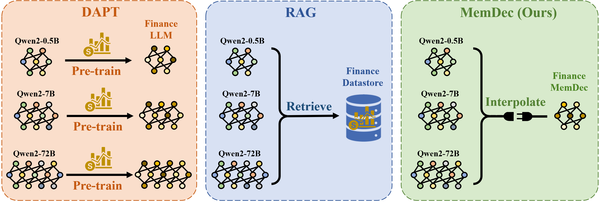

#  Memory Decoder：一种预训练的即插即用大语言模型记忆组件

<div align="center">

[](https://www.arxiv.org/abs/2508.09874)
[](https://huggingface.co/Clover-Hill/MemoryDecoder-gpt2-small)
[]()

</div>

<p align="center">
  <a href="https://www.arxiv.org/abs/2508.09874">Memory Decoder: A Pretrained, Plug-and-Play Memory for Large Language Models</a>
</p>

<p align="center">
  <em><strong>NeurIPS 2025 Poster</strong></em>
</p>

<p align="center">

</p>

---

## 📖 项目概述

Memory Decoder 提出了一种全新的大语言模型（LLM）领域自适应范式，弥合了**非参数检索方法**（如 kNN-LM）与**参数化微调方法**（如 DAPT）之间的鸿沟。

核心思想是：预训练一个轻量级的 Transformer 解码器，让它"内化"检索模式，从而在推理时无需实时检索就能获得类似 kNN 的知识增强效果。

**主要优势：**

- ✨ **即插即用**：单个 Memory Decoder 可增强任何共享同一分词器的模型
- 🚀 **高效推理**：无需检索开销，仅需并行前向传播
- 🎯 **领域专长**：像非参数方法一样捕获长尾知识
- 🔒 **保留原始能力**：原模型参数保持不变

与传统方法相比：
| 方法 | 需要重新训练？ | 推理延迟高？ |
|:----:|:----------:|:---------:|
| DAPT（领域自适应预训练） | ✅ 是 | ❌ 否 |
| RAG（检索增强生成） | ❌ 否 | ✅ 是 |
| **Memory Decoder** | **❌ 否** | **❌ 否** |

<p align="center">

</p>

---

## 🏗️ 工作原理

Memory Decoder 的训练流程分为三个阶段：

1. **提取嵌入**：从预训练语言模型中提取文本的隐层表示，构建数据存储（dstore）
2. **构建 KNN 检索信号**：基于 FAISS 索引，对每个 token 位置搜索最近邻，生成 KNN 概率分布作为训练目标
3. **KL 散度蒸馏训练**：训练 Memory Decoder 以 KL 散度为损失函数，使其输出逼近 KNN 分布

在推理阶段，将 Memory Decoder 的输出概率与基础模型的输出概率进行插值：

$$p_{\text{final}} = (1 - \lambda) \cdot p_{\text{LM}} + \lambda \cdot p_{\text{MemDec}}$$

其中 $\lambda$ 为超参数，控制 Memory Decoder 的贡献比例。

---

## 🚀 快速开始

### 🔧 环境配置

运行环境要求 **CUDA 12.4**，核心依赖如下：

```bash
# 步骤 1：安装 FAISS-GPU（注意版本，避免邻居排序 bug）
conda install -c pytorch -c nvidia faiss-gpu=1.12.0

# 步骤 2：安装 PyTorch
pip install torch==2.6.0 torchvision==0.21.0 torchaudio==2.6.0

# 步骤 3：安装其他依赖
pip install transformers==4.55.4 datasets==4.0.0 accelerate pyarrow evaluate loguru wandb tqdm
```

> [!IMPORTANT]
> - 请使用 faiss-gpu **1.12.0（不带 cuvs）**，1.11.0 w/ cuvs 存在邻居未按距离排序的 bug
> - 请使用 datasets **4.0.0**，更高版本的 Column 对象行为有变化

### 📊 评估与使用

#### 评估基础模型

```bash
DATASET=/path/to/dataset
MODEL=/path/to/base/model
OUTPUT_DIR=tmp/

CUDA_VISIBLE_DEVICES=0 python -m train_base \
    --model_name_or_path ${MODEL} \
    --dataset_name ${DATASET} \
    --per_device_eval_batch_size 16 \
    --do_eval \
    --eval_subset test \
    --output_dir ${OUTPUT_DIR} \
    --report_to none
```

#### 使用 Memory Decoder 评估

```bash
DATASET=/path/to/dataset
MODEL=/path/to/base/model
KNN_PATH=/path/to/memory/decoder
OUTPUT_DIR=tmp/

python -m evaluate_joint \
    --do_test \
    --model_name_or_path ${MODEL} \
    --dataset_name ${DATASET} \
    --dataset_split_name test \
    --per_device_eval_batch_size 16 \
    --output_dir ${OUTPUT_DIR} \
    --knn_temp 1 \
    --lmbda 0.55 \
    --knn_generator_path ${KNN_PATH} \
    --report_to none
```

### 🏆 WikiText-103 性能结果

| 基础模型 | 基础 PPL | +MemDec PPL | PPL 降低 |
|:-------:|:-------:|:-----------:|:-------:|
| GPT2-small | 24.89 | **13.36** | -11.53 |
| GPT2-medium | 18.29 | **12.25** | -6.04 |
| GPT2-large | 15.80 | **11.53** | -4.27 |
| GPT2-xl | 14.39 | **10.93** | -3.46 |

Memory Decoder（gpt2-small 规模）可使 GPT2-xl 的困惑度从 14.39 降至 10.93，效果显著。

### 💡 生成示例

```python
from demo.memDec import MemoryDecoder
import transformers
from transformers import AutoModelForCausalLM

# 加载模型
base_lm_path = "/path/to/gpt2-xl"
knn_generator_path = "/path/to/memdec-gpt2-small"

tokenizer = transformers.AutoTokenizer.from_pretrained(base_lm_path)
base_lm = AutoModelForCausalLM.from_pretrained(base_lm_path)
knn_generator = AutoModelForCausalLM.from_pretrained(knn_generator_path)

# 构建联合模型
base_lm.resize_token_embeddings(len(tokenizer))
knn_generator.resize_token_embeddings(len(tokenizer))
joint = MemoryDecoder(base_lm, knn_generator, lmbda=0.55, knn_temp=1.0).to("cuda")

# 生成文本
prompt = "As with previous Valkyira Chronicles games , Valkyria Chronicles III is"
inputs = tokenizer(prompt, return_tensors="pt").to("cuda")
out_ids = joint.generate(**inputs, max_new_tokens=20, do_sample=False)
print(tokenizer.decode(out_ids[0], skip_special_tokens=True))
```

**生成效果对比：**

| 模型 | 续写内容 |
|-----|---------|
| 基础模型 | *"...is a turn-based strategy game..."*（错误：策略游戏）|
| **+Memory Decoder** | *"...is a **role-playing** video game..."*（正确：角色扮演游戏）|

Memory Decoder 成功纠正了基础模型的事实性错误。

---

## 🛠️ 训练 Memory Decoder

### 📁 项目结构

```
MemoryDecoder/
├── knn_utils/
│   ├── build_index.py        # 构建 FAISS 索引
│   ├── saveEmbedMulti.py     # 多 GPU 保存嵌入
│   └── saveKNNMulti.py       # 搜索并保存 KNN 分布
├── scripts/
│   ├── evaluate_base_gpt.sh  # 评估基础模型
│   ├── evaluate_joint_gpt2.sh # 联合评估（基础模型 + MemDec）
│   ├── preprocess_dataset.sh # 数据集预处理
│   ├── save_pipeline.sh      # 完整 KNN 信号生成流程
│   ├── train_memdec.sh       # 训练 Memory Decoder（文本模型）
│   └── vlm_pipeline.sh       # VLM 版本完整流程
├── utils/
│   ├── cal_loss.py           # 损失函数工具
│   └── preprocess_dataset.py # 数据集预处理工具
├── demo/
│   ├── memDec.py             # Memory Decoder 生成类
│   └── generation_example.py # 生成示例脚本
├── train_base.py             # 基础模型训练/评估
├── train_memdec.py           # Memory Decoder 训练（文本模型）
├── train_memdec_vlm.py       # Memory Decoder 训练（VLM）
├── evaluate_joint.py         # 联合评估（文本模型）
├── evaluate_joint_vlm.py     # 联合评估（VLM）
├── vlm_save_embed.py         # VLM 嵌入提取
├── vlm_prepare_memdec_data.py # VLM 版训练数据准备
└── evaluate_vlm_memdec.py    # VLM Memory Decoder 评估
```

### 🔄 训练流程（文本语言模型）

#### 步骤 1：数据预处理
```bash
bash scripts/preprocess_dataset.sh
```

#### 步骤 2：构建 KNN 训练信号（三步）

**2a. 保存嵌入**
```bash
accelerate launch --config_file ${ACCELERATE_CONFIG} \
    -m train_base \
    --model_name_or_path ${MODEL} \
    --dataset_name ${DATASET} \
    --do_eval --eval_subset ${SUBSET} \
    --per_device_eval_batch_size ${BATCH_SIZE} \
    --output_dir ${OUTPUT_DIR} \
    --dstore_dir ${DSTORE_DIR} \
    --save_knnlm_dstore \
    --report_to none
```

**2b. 构建 IVFPQ 索引**
```bash
python -m knn_utils.build_index \
    --dstore_path ${DSTORE_PATH} \
    --num_keys_to_add_at_a_time ${NUM_KEYS} \
    --ncentroids ${NCENTROIDS} \
    --code_size ${CODE_SIZE} \
    --probe ${PROBE}
```

**2c. 搜索 KNN 分布**
```bash
accelerate launch --config_file ${ACCELERATE_CONFIG} \
    -m knn_utils.saveKNNMulti \
    --model_path ${MODEL} \
    --dstore_path ${DSTORE_PATH} \
    --val_path ${VAL_PATH} \
    --index_path ${INDEX_PATH} \
    --output_path ${OUTPUT_PATH} \
    --k ${K} --knn_temp ${KNN_TEMP} \
    --probe ${PROBE} --knn_gpu
```

或直接运行完整流程脚本：
```bash
bash scripts/save_pipeline.sh
```

#### 步骤 3：训练 Memory Decoder
```bash
bash scripts/train_memdec.sh
```

> [!NOTE]
> 训练支持从检查点自动恢复，多卡多节点分布式训练均已支持。

---

## 🖼️ VLM 扩展（视觉语言模型）

本项目还将 Memory Decoder 扩展至视觉语言模型（VLM），以 **Qwen2-VL-2B** 为骨干。

### VLM 训练流程（约 18 分钟）

| 步骤 | 脚本 | 说明 |
|:---:|------|------|
| 1 | `vlm_save_embed.py` | 提取 VLM 文本嵌入（Arrow 文件） |
| 2 | `knn_utils/build_index.py` | 构建 FAISS 索引 |
| 3 | `knn_utils/saveKNNMulti.py` | 生成 KNN 分布（需 `--val_path` 参数） |
| 4 | `vlm_prepare_memdec_data.py` | 准备含 dstore_range 的纯文本训练集 |
| 5 | `train_memdec_vlm.py` | KL 散度蒸馏训练 |

完整 VLM 流程：
```bash
bash scripts/vlm_pipeline.sh
```

### VLM 评估结果（New Yorker Caption Contest 验证集，130 样本）

| 配置 | 困惑度（PPL）|
|:---:|:-----------:|
| 仅 VLM | 12.53 |
| VLM + 未训练 MemDec（λ=0.25）| 11.51 |
| VLM + 已训练 MemDec（λ=0.25）| 11.90 |

### VLM 关键配置

- **模型**：Qwen2-VL-2B，隐层维度 1536
- **精度**：必须使用 bfloat16（float16 会导致 NaN）
- **MLP 路径**：`model.model.language_model.layers[-1].mlp`

---

## 📦 预训练检查点

| 模型 | Hugging Face 链接 |
|------|-----------------|
| MemoryDecoder-gpt2-small | [🤗 下载](https://huggingface.co/Clover-Hill/MemoryDecoder-gpt2-small) |

本仓库 `vlm_memdec_checkpoints/final/` 目录已包含 VLM 版 Memory Decoder 的训练好权重。

---

## 🙏 致谢

本实现受 [knn-transformers](https://github.com/neulab/knn-transformers) 的优秀工作启发，感谢其在检索增强语言建模领域的开创性贡献。

---

## 📧 联系方式

如有问题或讨论，请发送邮件至：**maximus.cao@outlook.com**

---

## 📚 引用

如果 Memory Decoder 对您的研究有帮助，请考虑引用：

```bibtex
@article{cao2025memory,
  title={Memory decoder: A pretrained, plug-and-play memory for large language models},
  author={Cao, Jiaqi and Wang, Jiarui and Wei, Rubin and Guo, Qipeng and Chen, Kai and Zhou, Bowen and Lin, Zhouhan},
  journal={arXiv preprint arXiv:2508.09874},
  year={2025}
}
```
